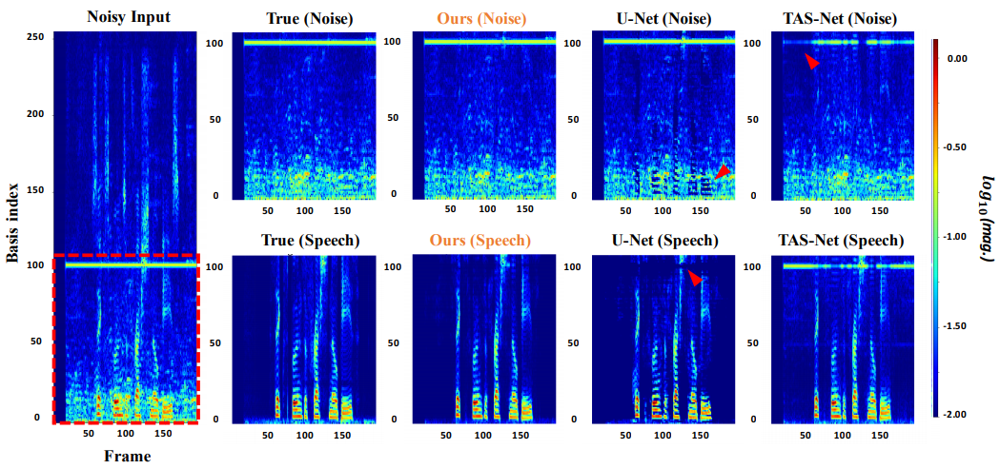

This is an old implementation for 
**"Multi-Domain Processing via Hybrid Denoising Networks for Speech Enhancement"**
(2018, [arxiv](https://arxiv.org/abs/1812.08914), [demo](https://mdphdnet.github.io)).

### Dependencies
This code was written with tensorflow <= 1.4.0 and python 3.5

### Contents
- speech data pre-processing codes (*tfrecordreadwrite.py*)
- differentiable STFT module (*Utils.py*)
- Various speech enhancement models (*net.py*: U-Net, LSTM on Spectrogram, TasNet on waveform)
- Hybrid models (*model.py*)
- Various objective functions for speech enhancement (*loss.py*)

To run codes, 
```
python main.py
```

Arguments are listed in *configuration.py*.

### Results


Note, 'Ours' represents a **multi-domain hybrid** model.  
